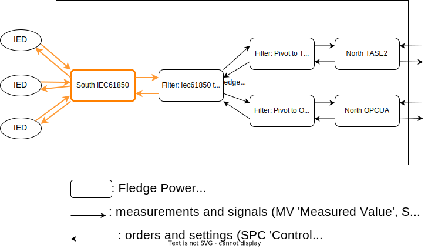
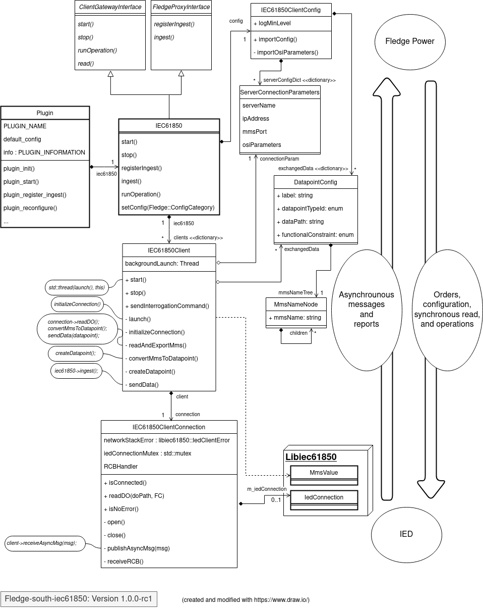

.. Images

===============================================================================
IEC61850 C/C++ South plugin
===============================================================================

A simple asynchronous IEC61850 plugin that pulls data from a server and sends
it to Fledge.

|South_IEC61850_plugin_context|

(use 'Drawio' -https://draw.io- for updating this diagram)

To build this plugin, you will need the libiec61850 library installed on your environment
as described below.

You also need to have Fledge installed from the source code, not from the
package repository.

Installing the build dependencies
=================================

Install dependencies with the Distribution package manager
----------------------------------------------------

RapidJson
^^^^^^^^^
 * for Debian:

.. code-block:: console

  $ sudo apt-get install rapidjson-dev

GoogleTest and Gcovr (for Unit Tests only)
^^^^^^^^^^
 * for Debian:
.. code-block:: console

  $ sudo apt-get install libgtest-dev libgmock-dev gcovr

Libiec61850 (IEC61850 protocol stack)
-----------
To build IEC61850 C/C++ South plugin, you need to download libiec61850 at:
https://github.com/mz-automation/libiec61850

.. code-block:: console

  $ git clone https://github.com/mz-automation/libiec61850.git
  $ cd libiec61850

Then, you can build and install libiec61850 with:

.. code-block:: console

  $ mkdir build
  $ cd build
  $ cmake -DBUILD_TESTS=NO -DBUILD_EXAMPLES=NO ..
  $ make
  $ sudo make install

Build
=====

To build Fledge IEC 61850 C++ South plugin:

To build a release:

.. code-block:: console

  $ mkdir build
  $ cd build
  $ cmake -DCMAKE_BUILD_TYPE=Release ..
  $ make

To build with unit tests and code coverage:

.. code-block:: console

  $ mkdir build
  $ cd build
  $ cmake -DCMAKE_BUILD_TYPE=Coverage ..
  $ make

- By default the Fledge develop package header files and libraries
  are expected to be located in /usr/include/fledge and /usr/lib/fledge
- If **FLEDGE_ROOT** env var is set and no -D options are set,
  the header files and libraries paths are pulled from the ones under the
  FLEDGE_ROOT directory.
  Please note that you must first run 'make' in the FLEDGE_ROOT directory.

You may also pass one or more of the following options to cmake to override 
this default behaviour:

- **FLEDGE_SRC** sets the path of a Fledge source tree
- **FLEDGE_INCLUDE** sets the path to Fledge header files
- **FLEDGE_LIB sets** the path to Fledge libraries
- **FLEDGE_INSTALL** sets the installation path of Random plugin

NOTE:
 - The **FLEDGE_INCLUDE** option should point to a location where all the Fledge 
   header files have been installed in a single directory.
 - The **FLEDGE_LIB** option should point to a location where all the Fledge
   libraries have been installed in a single directory.
 - 'make install' target is defined only when **FLEDGE_INSTALL** is set

Examples:

- no options

  $ cmake ..

- no options and FLEDGE_ROOT set

  $ export FLEDGE_ROOT=/some_fledge_setup

  $ cmake ..

- set FLEDGE_SRC

  $ cmake -DFLEDGE_SRC=/home/source/develop/Fledge  ..

- set FLEDGE_INCLUDE

  $ cmake -DFLEDGE_INCLUDE=/dev-package/include ..
- set FLEDGE_LIB

  $ cmake -DFLEDGE_LIB=/home/dev/package/lib ..
- set FLEDGE_INSTALL

  $ cmake -DFLEDGE_INSTALL=/home/source/develop/Fledge ..

  $ cmake -DFLEDGE_INSTALL=/usr/local/fledge ..

Using the plugin
================

As described in the Fledge documentation, you can use the plugin by adding
a service from the web API:

 - On the web API, go to the South tab
 - Click on "Add +"
 - Select iec61850 and give it a name, then click on "Next"
 - Change the default settings to your settings, then click on "Next"
 - Let the "Enabled" option checked, then click on "Done"

Plugin design
=============

Here, an overview of the plugin, with a UML class diagram:

|South_IEC61850_plugin_class_diagram|

